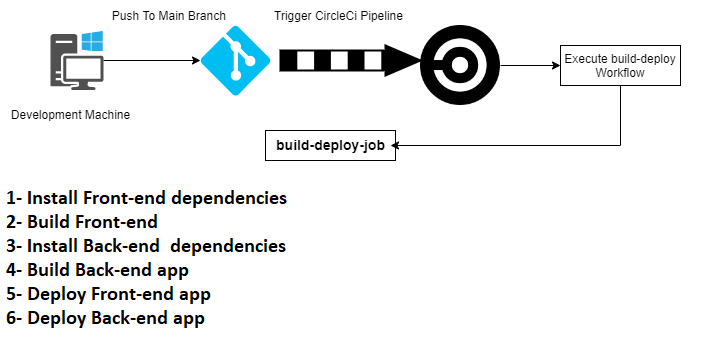
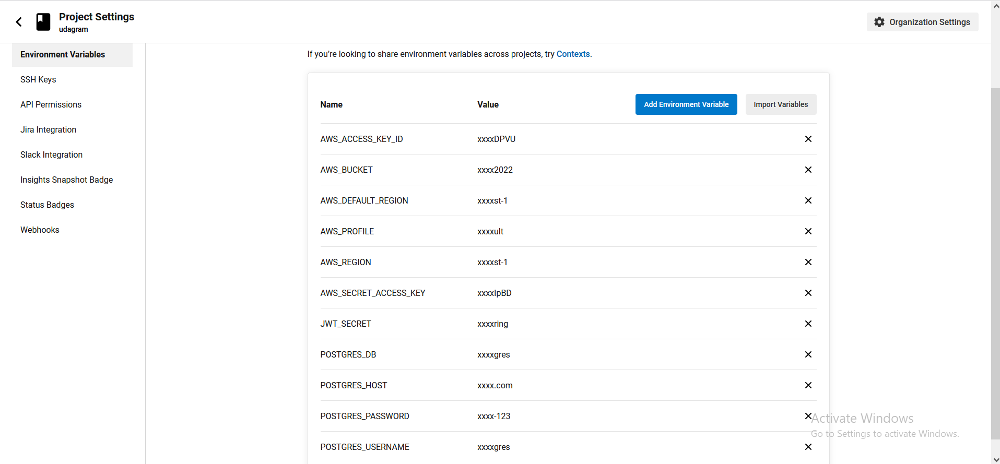
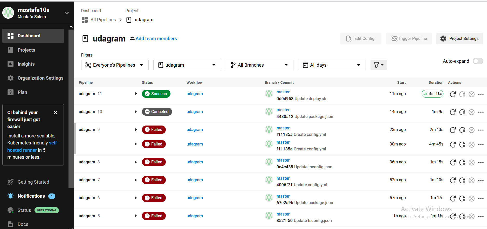
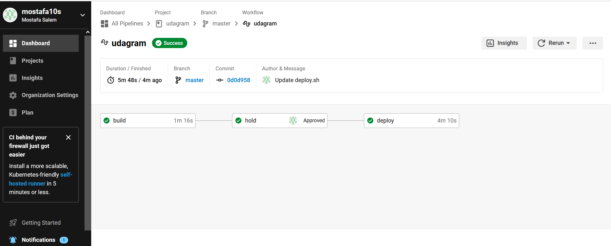
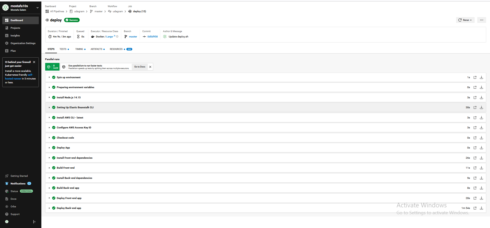

# Pipeline

Continuous delivery is a software development practice where code changes are automatically prepared for a release to production. A pillar of modern application development, continuous delivery expands upon continuous integration by deploying all code changes to a testing environment and/or a production environment after the build stage. When properly implemented, developers will always have a deployment-ready build artifact that has passed through a standardized test process. .

This App Uses CircleCI Pipeline for automating process of the deployment on aws

## Pipeline Processes

1. Pipeline start after any push on the master branch at the repository
2. checkout the git repository
3. installing application dependencies for front-end and apis server
4. build and deploy front-end application to aws s3 bucket
5. build and deploy back-end to Elastic Beanstalk Environment

## Diagram

## Pipeline Configuration

